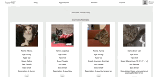

# FosterPet

Created by Laura Jinks Jimenez

## Technologies Used

Javascript | React | Node.js | PostgreSQL | Express | Redux | Firebase Storage

## Purpose

This app was built to practice building a full stack web application from start to finish.

## Features

* FosterPet is a site to connect animal foster organizations with foster volunteers. Users can sign up or log in as either a foster or organization.

 

 

* From a foster account, users can find organizations by U.S. state and apply to join them

 

 

* Once a user is a member of one or more organizations, they can see a list of all animals in need of fostering from all of their organizations, and request to foster individual animals. The organization must then approve the request, and finally the user must accept 

 

 

* Foster users can also search for adoptable pets via the Petfinder API by zipcode, animal type, age, gender, and size.

 

 

* As an organization, a user's dashboard shows a list of all current animals in the organization, as well as the number of pending applications. The organization can also create a custom application for potential members to fill out.

 

 

* Organizations can write and edit blog posts that are then posted on all members' dashboards.

 

 

* Organizations can view a detailed list of each animal in their system and edit their listings.

 

 

* Organizations can add new animals to their database.

 

